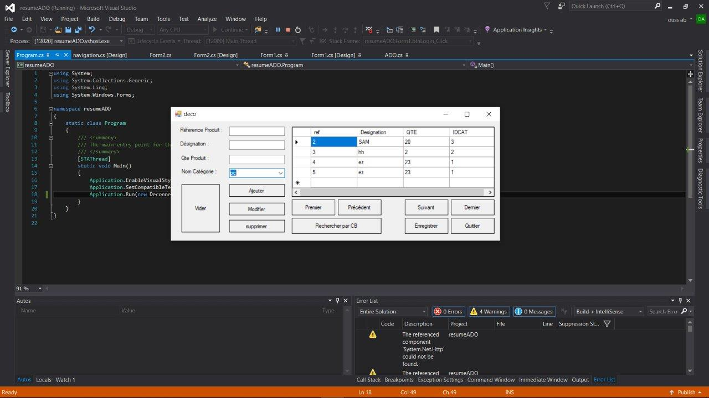
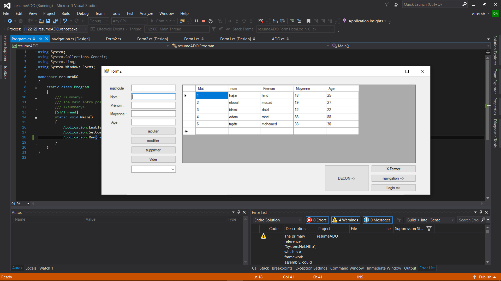

# ADO Resumé 

ADO Crud Application that interacts with an SQL Server Using Different approaches  

## What i've Learned 

The diffirence between : 
* the connected mode : which uses the direct approach interaction with the database .
* the disconnected mode : which uses a data set to store data, 
in order to push them on the database at a later time ,ex: when user clicks the save button.

## Srceenshots : 
### Disconnected Mode : 

### Connected Mode : 

